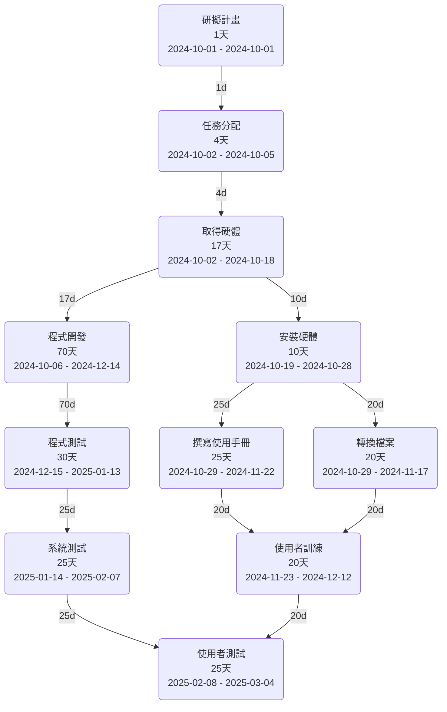
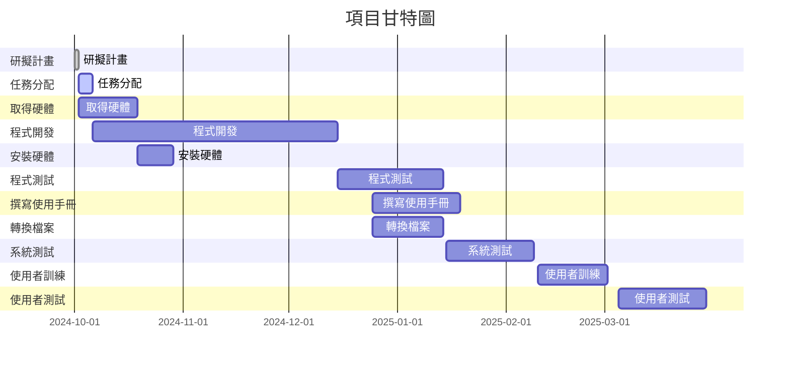
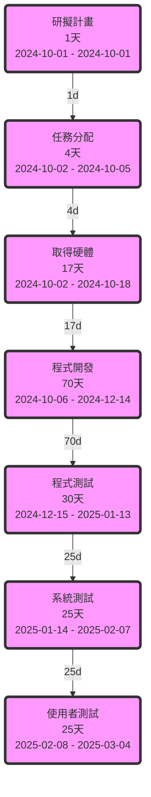

# PERT/CPM圖

```mermaid
graph TD;
    A(研擬計畫<br/> 1天<br/> 2024-10-01 - 2024-10-01) -->|1d| B(任務分配<br/> 4天<br/> 2024-10-02 - 2024-10-05);
    B -->|4d| C(取得硬體<br/> 17天<br/> 2024-10-02 - 2024-10-18);
    C -->|17d| D(程式開發<br/> 70天<br/> 2024-10-06 - 2024-12-14);
    D -->|70d| E(程式測試<br/> 30天<br/> 2024-12-15 - 2025-01-13);
    C -->|10d| F(安裝硬體<br/> 10天<br/> 2024-10-19 - 2024-10-28);
    F -->|20d| G(轉換檔案<br/> 20天<br/> 2024-10-29 - 2024-11-17);
    F -->|25d| H(撰寫使用手冊<br/> 25天<br/> 2024-10-29 - 2024-11-22);
    E -->|25d| I(系統測試<br/> 25天<br/> 2025-01-14 - 2025-02-07);
    H -->|20d| J(使用者訓練<br/> 20天<br/> 2024-11-23 - 2024-12-12);
    G -->|20d| J;
    I -->|25d| K(使用者測試<br/> 25天<br/> 2025-02-08 - 2025-03-04);
    J -->|20d| K;

```
# 甘特圖

```mermaid
gantt
        title 項目甘特圖
    dateFormat  YYYY-MM-DD
    section 研擬計畫
    研擬計畫         :done,    des1, 2024-10-01, 1d
    section 任務分配
    任務分配        :active,  des2, 2024-10-02, 4d
    section 取得硬體
    取得硬體        :         des3, 2024-10-02, 17d
    section 程式開發
    程式開發        :         des4, 2024-10-06, 70d
    section 安裝硬體
    安裝硬體        :         des5, 2024-10-19, 10d
    section 程式測試
    程式測試        :         des6, 2024-12-15, 30d
    section 撰寫使用手冊
    撰寫使用手冊    :         des7, 2024-12-25, 25d
    section 轉換檔案
    轉換檔案        :         des8, 2024-12-25, 20d
    section 系統測試
    系統測試        :         des9, 2025-01-15, 25d
    section 使用者訓練
    使用者訓練      :         des10, 2025-02-10, 20d
    section 使用者測試
    使用者測試      :         des11, 2025-03-05, 25d

```
# 關鍵路徑

```mermaid
graph TD;
    A(研擬計畫<br/> 1天<br/> 2024-10-01 - 2024-10-01) -->|1d| B(任務分配<br/> 4天<br/> 2024-10-02 - 2024-10-05);
    B -->|4d| C(取得硬體<br/> 17天<br/> 2024-10-02 - 2024-10-18);
    C -->|17d| D(程式開發<br/> 70天<br/> 2024-10-06 - 2024-12-14);
    D -->|70d| E(程式測試<br/> 30天<br/> 2024-12-15 - 2025-01-13);
    E -->|25d| I(系統測試<br/> 25天<br/> 2025-01-14 - 2025-02-07);
    I -->|25d| K(使用者測試<br/> 25天<br/> 2025-02-08 - 2025-03-04);
    
    style A fill:#f9f,stroke:#333,stroke-width:4px
    style B fill:#f9f,stroke:#333,stroke-width:4px
    style C fill:#f9f,stroke:#333,stroke-width:4px
    style D fill:#f9f,stroke:#333,stroke-width:4px
    style E fill:#f9f,stroke:#333,stroke-width:4px
    style I fill:#f9f,stroke:#333,stroke-width:4px
    style K fill:#f9f,stroke:#333,stroke-width:4px

```
