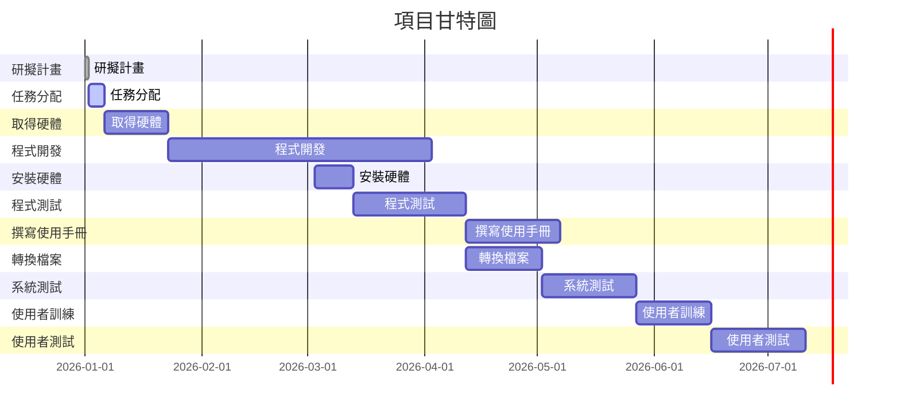
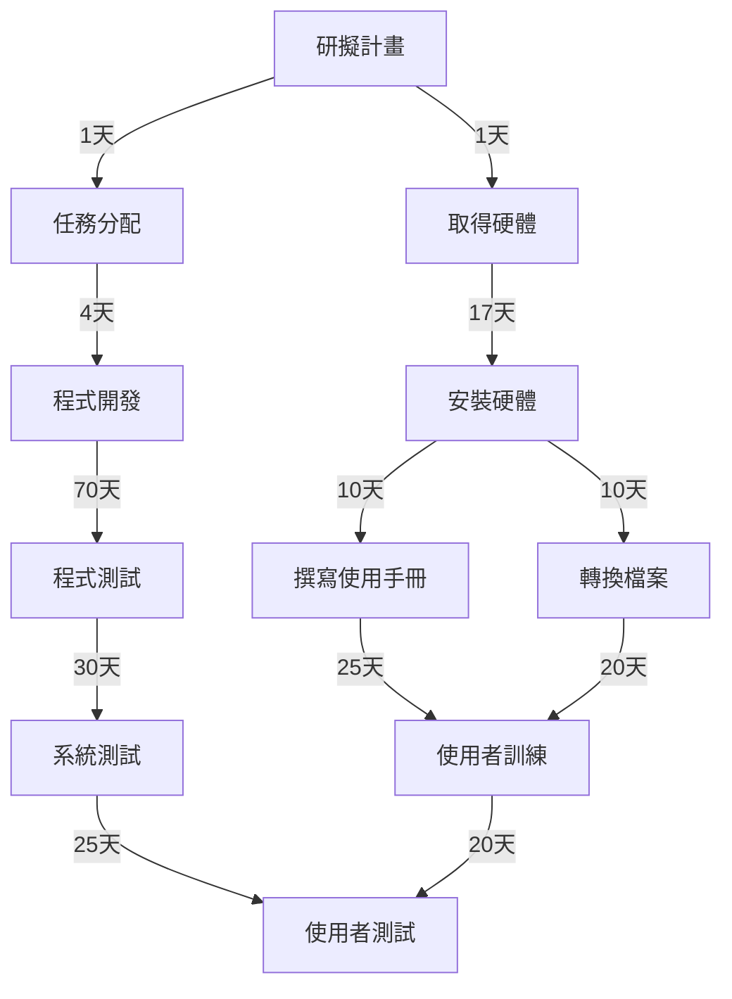
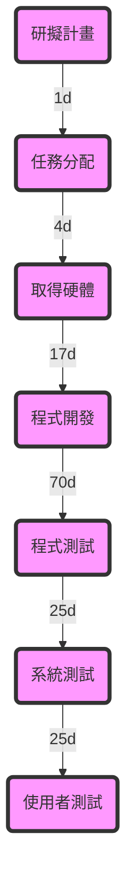

# 項目甘特圖

```mermaid
gantt
    title 項目甘特圖
    dateFormat  MM-DD
    section 研擬計畫
    研擬計畫         :done,    des1, 01-01, 1d
    section 任務分配
    任務分配        :active,  des2, 01-02, 4d
    section 取得硬體
    取得硬體        :         des3, 01-06, 17d
    section 程式開發
    程式開發        :         des4, 01-23, 70d
    section 安裝硬體
    安裝硬體        :         des5, 03-03, 10d
    section 程式測試
    程式測試        :         des6, 03-13, 30d
    section 撰寫使用手冊
    撰寫使用手冊    :         des7, 04-12, 25d
    section 轉換檔案
    轉換檔案        :         des8, 04-12, 20d
    section 系統測試
    系統測試        :         des9, 05-02, 25d
    section 使用者訓練
    使用者訓練      :         des10, 05-27, 20d
    section 使用者測試
    使用者測試      :         des11, 06-16, 25d

```

```mermaid
flowchart TD
    A[研擬計畫] -->|1天| B[任務分配]
    A -->|1天| C[取得硬體]
    B -->|4天| D[程式開發]
    C -->|17天| E[安裝硬體]
    D -->|70天| F[程式測試]
    E -->|10天| G[撰寫使用手冊]
    E -->|10天| H[轉換檔案]
    F -->|30天| I[系統測試]
    G -->|25天| J[使用者訓練]
    H -->|20天| J[使用者訓練]
    I -->|25天| K[使用者測試]
    J -->|20天| K[使用者測試]
```

```mermaid
graph TD;
    A(研擬計畫) -->|1d| B(任務分配);
    B -->|4d| C(取得硬體);
    C -->|17d| D(程式開發);
    D -->|70d| E(程式測試);
    E -->|25d| I(系統測試);
    I -->|25d| K(使用者測試);
    style A fill:#f9f,stroke:#333,stroke-width:4px
    style B fill:#f9f,stroke:#333,stroke-width:4px
    style C fill:#f9f,stroke:#333,stroke-width:4px
    style D fill:#f9f,stroke:#333,stroke-width:4px
    style E fill:#f9f,stroke:#333,stroke-width:4px
    style I fill:#f9f,stroke:#333,stroke-width:4px
    style K fill:#f9f,stroke:#333,stroke-width:4px


```
